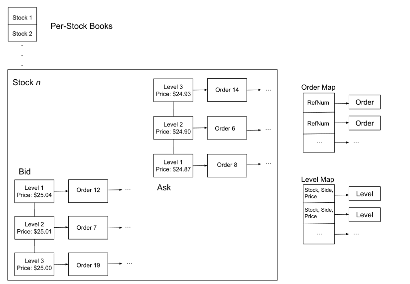

# Improving Order Book Performance by 3.6x

In this article, I will explore different techniques to optimize the performance of an order book data structure.
I measure the impact of these techniques on the total running time for building order books using Nasdaq stock exchange’s feed data.
These techniques achieved a reduction in total running time of 72%, or an improvement of about 3.6x.

## What is an Order Book?
An order book is a data structure used by stock exchanges and market participants to track unfilled orders and determine whether they can be filled when new orders arrive.
Orders belong to one of two sides, buy (bid) or sell (ask).
Limit orders specify a maximum buying price or minimum selling price, and the book sorts each side into levels from best to worst price.
Higher prices are considered better for the bid side, and lower prices are better for the ask side.
Within each level, orders are typically sorted by the time they were placed.
On the other hand, market orders execute at the current best price in the book.
They effectively have an infinite limit for buying and a limit of 0 for selling, and are marketable as long as there are orders on the other side.

An incoming buy order is marketable if its price is no lower than the lowest sell order resting in the book, and a sell order is marketable if its price is no higher than the highest buy order.
If a buy order’s price is no lower than an ask order’s, the orders are eligible for matching.
If multiple resting orders are eligible for matching, those with the best price take priority, and among those with the best price, earlier orders have higher priority.  A *day* order rests on the book if it is not marketable, until it fully excutes with future contra-side orders or gets canceled.  An *IOC* (immediate or cancel) order, on the other hand, is immediately canceled if not fully matched. It never shows up on the book. So when a new order arrives, there are a few possibilities:
1. The incoming order is not marketable, and gets posted to the book (or canceled if IOC)
2. It is marketable and fully executes with matching resting orders
3. It is marketable and partially executes with matching resting orders, then the remainder is posted on the book (or canceled if IOC)

To illustrate the scenarios, below is a snapshot from a book with only a few levels:
| Level | Order # | Time    | Size | Bid Price |
| ----- | ------- | ------- | ---- | --------- |
| 1     | 25      | 2:37:08 | 100  | $115.00   |
| 2     | 27      | 2:38:10 | 300  | $114.98   |
| 3     | 24      | 2:37:07 | 200  | $114.95   |

| Level | Order # | Time    | Size | Ask Price |
| ----- | ------- | ------- | ---- | --------- |
| 1     | 22      | 2:37:00 | 200  | $115.03   |
|       | 23      | 2:37:03 | 50   | $115.03   |
| 2     | 26      | 2:38:08 | 500  | $115.05   |

Suppose a market order was placed to sell 200 shares.
First there is a trade with order 25, which only covers 100 shares.
Order 27 has the next-best price, so the remaining 100 are taken from there.
The market order fully executes immediately, so the sell side remains the same while bid side would look like this afterwards:
| Level | Order # | Time    | Size | Bid Price |
| ----- | ------- | ------- | ---- | --------- |
| 1     | 27      | 2:38:10 | 200  | $114.98   |
| 2     | 24      | 2:37:07 | 200  | $114.95   |

Now, suppose a buy order of 300 shares at $115.04 was placed at 2:38:24.
Since there are only 250 shares on the sell side with ask price <= $115.04, the new order would partially execute, then be placed into the book:
| Level | Order # | Time    | Size | Bid Price |
| ----- | ------- | ------- | ---- | --------- |
| 1     | 29      | 2:38:24 | 50   | $115.04   |
| 2     | 27      | 2:38:10 | 200  | $115.00   |
| 3     | 24      | 2:37:07 | 200  | $114.98   |

| Level | Order # | Time    | Size | Ask Price |
| ----- | ------- | ------- | ---- | --------- |
| 1     | 26      | 2:38:08 | 500  | $115.05   |

In reality there may be hundreds of thousands of orders in the book at a given time, being added and updated constantly. An efficient book data structure is thus essential to the smooth operation of exchanges and for market participants.

## Original Version
<p align="center">
  
</p>

I started out with an open-source order book implementation from github that uses the C++ standard template library. The overall structure is illustrated above.
- An *OrderBook* contains an array of per-stock books. Stocks are indexed by an integer ID. It also contains two unordered maps: *orders* (reference number → order) and *levels* (tuple of stock index, side, and price → level).
- Each per-stock book is divided into two *Halves*, *Ask* and *Bid*.
- A *Half* contains a linked list of levels sorted by price (*LevelList*). On the ask side, the lowest price is in the front of the list, while on the bid side, the highest price is in the front.
- A *Level* contains a linked list of orders (*OrderList*) and an iterator pointing to its location in the *Half*’s linked list, so the level can be removed in constant-time once empty.
- An *Order* includes a reference number, stock ID, side, quantity, price, and create/update timestamps, plus an iterator pointing to its location in the *Level*’s linked list (also used to remove itself).

*OrderBook* performs several frequent operations that have visible effects:
- *newOrder*: adds a new order to the book. The operation looks in the level map for the level the order belongs to. If the appropriate level for its price is not present, a new one is created and inserted in the LevelList for its stock and side. The order is then appended to the end of that level, and added to the order map. Assuming most new orders join existing levels, this operation takes the same time as one lookup to the level map and one insertion to the order map, which is probably constant. In a degenerative case where the order is on a new level deep in the LevelList, time complexity is O(n) where n is the number of levels.
- *deleteOrder*: erases an order from the book. It first finds the order with the given reference number in the order map, then removes the order from the linked list of its level. If the level becomes empty, the level is removed from its half and from the level map, then destroyed. Then the order itself is removed from the order map and destroyed. deleteOrder is an O(1) operation assuming searching and erasing from the maps takes constant time. Erasing from linked lists must be O(1) since levels and orders “know” their own neighbors by storing iterators.
- *replaceOrder*: changes the price and / or size of an existing order. First searches the order map to determine whether the original reference number is present. If so, it performs *deleteOrder*, followed by *newOrder* with a new reference number. This operation is thus linear with respect to the number of levels at worst.
- *reduceOrder*: reduces the size of an existing order. Performs a lookup like *deleteOrder*, but changes the size field in-place instead, so it most likely takes constant time.
- *executeOrder*: identical to *reduceOrder* for partial executions, and identical to *deleteOrder* for full executions.

Another common operation, done by exchanges and market participants, is iterating over levels from best price to worst. Maintaining sorted order of the levels is essential for efficient iteration.

*OrderBook*’s performance is benchmarked by replaying one day (12/30/2019) of Nasdaq’s ITCH feed to a book printer utility with output disabled.
Data was obtained from [Nasdaq's website](https://emi.nasdaq.com/ITCH/Nasdaq%20ITCH/), uncompressed and stored on an SSD.
The program spends most of its time building order books, and a smaller amount of time reading and parsing messages from the SSD.
Order and level maps are presized to 4 million and 1 million entries respectively.
According to the output of the time utility, this originally took about 174 seconds in user and system time combined (the 8 seconds spent loading and parsing data were excluded from this and all future results). Other statistics were obtained using the [perf](https://perf.wiki.kernel.org/index.php/Main_Page) profiling tool.
The system is running Fedora Linux with 6.8.11 kernel version, on an Intel Core i5-7400 3.4GHz CPU with 24GB physical memory. Code is compiled with gcc 14.1.1 at -O2 optimization level.

## Step 1: Intrusive Linked Lists
According to the profiling output by *perf*, the most time-consuming operation is *newOrder*.
One reason the baseline is not very fast is that it uses the library components *std::list* and *std::unordered_map*, which must allocate and deallocate internal nodes and are less cache-friendly than alternatives.

*OrderList* and *LevelList* are both *std::lists*, which are node-based linked lists: internally, each list node contains a value, plus a prev and a next pointer.
Whenever a value is inserted, a node is allocated on the heap, to be freed once the value is erased.
As allocation and deallocation are slow, the Boost library’s *intrusive::list* is a more efficient alternative.
An intrusive list avoids heap allocation by storing linked list hooks (prev and next pointers) in the values themselves, rather than wrapping them in nodes.
To use intrusive lists, the *Order* and *Level* classes must be modified to incorporate *list_base_hooks*.
The hooks are set to *normal_mode* (rather than the default *safe_mode* which checks some assertions not needed here), and *constant_time_size* is enabled for the lists.

Furthermore, iteration is faster when there is no distinction between the node and the object, since there are fewer memory accesses: iterating through node-based lists requires dereferencing the node, then its members separately.
Also, getting an iterator to an intrusive list element is constant-time because hooks can perform all the same functions as iterators, such as erasing an element from a list.
Therefore, *Order* and *Level* objects no longer need to store list iterators.
The net book-building time is now reduced from 174 seconds to 146.

## Step 2: Huge Pages
In modern computer systems, the addresses referred to in programs are not physical locations in memory.
Rather, they are “virtual” ones that give each process the illusion of having the entire address space available, while also preventing processes from interfering with each other.
Memory is divided into virtual pages which map to physical frames, and translation from one to the other is done using a page table in the main memory.
Memory access thus involves first looking up the virtual address in the page table, and then accessing the physical address.
Since main memory is slow to access, the CPU also contains a small Translation Lookaside Buffer (TLB), usually between 16 and 512 entries, which caches recently looked up pages.

A TLB miss occurs when the desired page is not found in the TLB.
In that case, lookup is done on the page table and the newly-searched entry replaces one of the cached entries.
The more memory a process uses at the same time, the more TLB misses occur. According to *perf stat*, there are currently around 1.46 billion misses when running the benchmark.
Performance thus improves if more addresses can be covered by the same number of TLB entries, and the most obvious way is increasing page size from the standard 4KB to a “huge page” with a larger memory block.
There are multiple ways to increase page size without changing any code, such as enabling Linux’s Transparent HugePage Support.
I chose to install Microsoft’s [mimalloc](https://github.com/microsoft/mimalloc) allocator since it is easier to configure.
I enabled the *MIMALLOC_ALLOW_LARGE_OS_PAGES* option, which uses 2MB pages when available.
There is also a 1GB option, though pages too large for the program’s needs may leave a lot of memory allocated but unused.
After enabling large pages, the number of TLB misses is reduced to about 5.6 million and net book-building time from 146 to 122 seconds.

## Step 3: Flat Hash Map
Insertion into a hash map involves calculating the result of the hash function, using the result to locate a bucket in the bucket table, checking that the key is not already present, and collision resolution in case multiple keys share the bucket.
Chaining and open addressing are the two main ways to resolve collisions.
In a chained hash map, each bucket contains a linked list or tree of colliding key/value pairs.
*std::unordered_map*s are of this variety, and as mentioned earlier *OrderBook* contains two: one from reference number to order, and another from index, side and price to level.
These are used to create and destroy new elements before adding/removing from lists, and to find orders and levels in constant time.

In contrast, open-addressed maps store only one element per bucket.
In case of collision an alternative, empty bucket is found via linear or quadratic probing, putting the first result through a second hash function, or using a different hash function.
Open addressing is often more efficient than chaining, which typically uses node-based structures for buckets.
Inserting new elements would thus require heap allocation, as mentioned in Step 1.
Another advantage of open addressing is that storing every element in one array is cache-friendly, since arrays are contiguous in memory.
However, open addressing is more sensitive to choice of hash function.

One popular implementation of an open-addressed map is [*absl::flat_hash_map*](https://github.com/abseil/abseil-cpp), called “flat” since key-level pairs are stored directly inside the array.
Abseil provides a hashing framework designed specifically for *flat_hash_map* which works very well for numerical keys, *absl::Hash*.
After I replaced the *unordered_map* used by both the order and level maps with *flat_hash_map*, the benchmark took only 100 seconds, down from 122.

## Step 4: Object Pool
Next, a custom *ObjectPool* class was created for this project, and a *levelPool* and *orderPool* added to *OrderBook*.
Pooling is a design pattern that reduces the time taken to allocate and free fixed-size memory chunks.
This is useful for creating and destroying many of the same object type, but unlike the standard new and delete, it is more like memory chunks are borrowed and returned.
When an *ObjectPool* is instantiated, it allocates room for a set number of fixed-size chunks.
When a program creates an object, it is constructed in one of the reserved chunks.
More space is only allocated once all the reserved chunks are in use.
When an object is destroyed, the space it occupies is still reserved for creating another of the same object type.
Reducing time spent on memory allocation makes this useful for large objects and those that are created and destroyed frequently (such as orders and levels).
Net book-building time is now down to 87 seconds, down from 100 seconds.

## Step 5: B-Tree Map
*newOrder* remains the most time-consuming operation even after these optimizations.
Note that *Level*’s constructor automatically inserts it into a *Half* such that sorted order is maintained.
*Half*’s insert method just iterates through the *LevelList*, making comparisons until the newly-created *Level*’s price is in-between two extant ones (or the end of the list is reached), which takes linear time.

In this step, I added a [*tlx::btree_map*](https://tlx.github.io/index.html) from prices to levels (*LevelMap*) to each *Half*, reducing the insertion time to logarithmic.
Like binary search trees, B-trees are used for sorting, but can have multiple elements and branches per node and are self-balancing.
B-trees also have better cache performance than binary trees because elements in one node are stored contiguously, so it is better in that regard to have more than two elements per node.
One type of B-tree is a B+ tree, in which internal nodes store only keys and leaf nodes store only values.
The leaf nodes also connect to form a sorted linked list.
As *tlx::btree_map* is a B+ tree, it can replace the *LevelList* entirely.
After this change, benchmark time decreased to 56 seconds, down from 87.

## Step 6: emhash7
After Step 3, I learned that *absl::flat_has_map* isn’t actually the fastest flat hash map implementation around.
According to [Martin Ankerl’s benchmarking](https://martin.ankerl.com/2022/08/27/hashmap-bench-01/), one of the best maps for inserting and deleting numbers (the most frequent operations in *OrderBook*) is [*emhash7::HashMap*](https://github.com/ktprime/emhash), particularly when using the [*ankerl::unordered_dense::hash*](https://github.com/martinus/unordered_dense) or the mumx hash.
I replaced the *flat_has_maps* with this version, reducing time from 56 to 49 seconds.

## Step 7: Branchless LevelCompare
When code contains branches/conditional statements, the CPU will attempt to predict which branch is taken (ex. by frequency of each branch in the past), then fetch and speculatively execute the instructions that follow.
If the prediction is wrong, those instructions need to be flushed from the CPU pipeline, incurring a misprediction penalty.
According to *perf stat*, there are currently 18.9 billion branches when running the benchmark, of which about 800.5 million are mispredicted.

Each *LevelMap* contains a *LevelCompare* struct that maintains its sorted order.
It has a custom less-than operator which returns a different value depending on the *LevelMap*’s side, since the ask and bid sides are sorted in different directions:
```
struct LevelCompare {
   Side side;
   bool operator()(Price left, Price right) const {
      if (side == Side::Ask) {
         return left < right;
      } else {
         return left > right;
      }
   }
};
```

A small optimization is condensing the return statement into one line that uses bitwise operations instead of branching.
Afterwards, there are only 18.5 billion branches and 790 million mispredictions:
```
struct LevelCompare {
   bool isBid;
   bool isAsk;
   bool operator()(Price left, Price right) const {
      return (isAsk & (left < right)) | (isBid & (left > right));
   }
};
```
As this is a local change affecting a small part of the program, the improvement is not as significant as the other steps. There is still a net improvement in performance, reducing runtime to 48 seconds from 49 seconds.

## Summary
Here is a table listing the benchmark time in seconds and percent saving from the original time after the application of each step, for two datasets: the 12/30/19 dataset the improvements were designed around, and a larger set from 12/30/20.
After each run, 8 seconds were subtracted for the first dataset and 12 for the second.
This was the time spent loading and parsing the data files, which is unaffected by the optimizations (ex. the baseline took 182 seconds but net book-building time was recorded as 174).
| Step | Time (12/30/19) | Saving (12/30/19) | Time (1/30/20) | Saving (12/30/20) |
| -------- | ---------- | ----------------- | -------------- | ----------------  |
| Baseline | 174 | - | 294 | - |
| boost::intrusive::list | 146 | 16.1% | 246 | 16.3% |
| Huge pages | 122 | 13.8% | 201 | 15.3% |
| absl::flat_hash_map | 100 | 12.6% | 165 | 12.2% |
| ObjectPool | 87 | 10.5% | 145 | 6.8% |
| tlx::btree_map | 65 | 12.6% | 105 | 13.6% |
| emhash7::HashMap | 49 | 12.9% | 81 | 8.2% |
| branchless LevelCompare | 48 | 0.8% | 80 | 0.3% |

At the end, the data structure is about 3.6x more efficient than the baseline.
The techniques and data structures used in this study are individually well known.
This study combines them to optimize the order book data structure and compares their relative effectiveness. The result is a highly efficient general-purpose order book implementation.
This is as far as I have gotten given the time I spent on this project.  There are obvious limitations of this work:
- Benchmarking only uses limited historical data freely available from one stock exchange,
- Benchmarking is done on total runtime of book building alone, not on real time latency of a full application.

Nevertheless, I hope this work provides some useful data points to those working on more specific data and applications.
I am open to other techniques that may further improve the order book's performance.

## About the Author
I am Lillian Qin, a third-year computer science student at the University of Washington in Seattle. I am currently looking for an internship or full-time position in computer science-related fields. If you have any opportunities, you can reach me at *lillianqin.j AT gmail.com*. I will be happy to send you my resume. 
